# Chạy LFM RaceBench trên RTX 4080 Super với WSL2 Ubuntu 22.04

Đây là hướng dẫn thực thi đã được kiểm chứng trên máy Windows có RTX 4080
Super 16 GB. Mục tiêu là tái tạo **phương pháp thí nghiệm** bằng vLLM, không
phải tái tạo điểm tuyệt đối của H200 MIG hoặc hệ thống chấm cuộc thi.

## Đường chạy khuyến nghị

Nếu repository đang nằm trên Windows, hãy chạy mọi lệnh điều khiển từ
PowerShell. Script sẽ tự copy source sang filesystem Linux nhanh hơn trong WSL.

```mermaid
flowchart LR
    A["Windows repository"] --> B["PowerShell bootstrap"]
    B --> C["Ubuntu 22.04 WSL2"]
    C --> D["WSL ext4 mirror"]
    D --> E["Pinned Python + vLLM"]
    E --> F["Doctor"]
    F --> G["Smoke: 4 requests"]
    G --> H["Baseline: 420 requests"]
    H --> I["A/B/A: 1,260 requests"]
    I --> J["Decision + drift guard"]
```



Ba lệnh quan trọng nhất, chạy tại repository root trong PowerShell:

```powershell
# 1. Cài đặt và xác nhận model có thể serve
.\scripts\rtx4080_bootstrap.ps1 -Run smoke

# 2. Đo một baseline 70 conversations × 6 turns
.\scripts\rtx4080_bootstrap.ps1 -Run baseline

# 3. So sánh R0 → candidate → R0′ và kiểm tra drift
.\scripts\rtx4080_bootstrap.ps1 -Run aba
```

Không cần mở server thủ công, không cần Docker và không cần cài CUDA Toolkit
đầy đủ trong Ubuntu.

## Trước khi bắt đầu

Bạn cần:

- Windows 10/11 với NVIDIA driver đang hoạt động;
- RTX 4080 Super 16 GB;
- Ubuntu 22.04 được cài dưới WSL2;
- khoảng 25 GB disk trống và Internet cho lần cài/model download đầu tiên;
- đóng game, Stable Diffusion, trình render hoặc chương trình khác đang dùng VRAM.

Driver GPU nằm trên Windows. **Không cài `nvidia-driver-*` bên trong Ubuntu
WSL.** WSL sẽ map driver Windows vào Linux.

## Bước 1 — xác nhận đúng Ubuntu 22.04 WSL2

Mở PowerShell. Các lệnh sau không cần Administrator nếu WSL đã được cài:

```powershell
wsl --list --verbose
wsl -d Ubuntu-22.04 -- cat /etc/os-release
wsl -d Ubuntu-22.04 -- nvidia-smi
```

Kết quả cần thấy:

```text
NAME             STATE    VERSION
Ubuntu-22.04     ...      2

PRETTY_NAME="Ubuntu 22.04..."
NVIDIA GeForce RTX 4080 SUPER
```

Nếu chưa có distro, chỉ bước cài này cần PowerShell chạy với Administrator:

```powershell
wsl --install -d Ubuntu-22.04
wsl --update
```

Sau đó restart Windows nếu được yêu cầu, chạy `wsl -d Ubuntu-22.04` một lần
và hoàn tất việc tạo Linux username/password.

## Bước 2 — cài hai công cụ hệ thống nhỏ

Mở Ubuntu:

```powershell
wsl -d Ubuntu-22.04
```

Trong terminal Ubuntu, chạy:

```bash
sudo apt-get update
sudo apt-get install -y curl rsync
exit
```

`curl` tải trình quản lý Python `uv`. `rsync` copy repository từ `/mnt/c` sang
WSL ext4. Setup sẽ tự cung cấp compiler cho Triton nếu Ubuntu chưa có
`gcc`/`clang`; bạn không cần tự cài CUDA Toolkit hoặc `nvcc`.

## Bước 3 — đi đến repository trong PowerShell

Ví dụ:

```powershell
cd C:\Users\YOUR_NAME\source\repos\cuda_vllm_optimize
Test-Path .\scripts\rtx4080_bootstrap.ps1
```

`Test-Path` phải trả `True`. Không chạy script từ thư mục `scripts`; hãy đứng ở
repository root như ví dụ trên.

## Bước 4 — setup và smoke test

```powershell
.\scripts\rtx4080_bootstrap.ps1 -Run smoke
```

Lần đầu có thể mất nhiều phút vì phải tải Python, vLLM/PyTorch/CUDA wheels và
model. Script thực hiện tuần tự:

1. chọn chính xác distro `Ubuntu-22.04`;
2. xác nhận GPU qua `nvidia-smi`;
3. mirror Windows checkout vào `~/src/cuda-vllm-optimize` trên WSL ext4;
4. tạo venv `~/.venvs/lfm-racebench-rtx4080` với Python 3.12;
5. pin vLLM 0.25.1 và model revision;
6. chạy doctor;
7. start vLLM, đợi health endpoint, gửi 4 streaming requests rồi stop server;
8. lưu config, manifest, server log và raw request records.

Checkpoint thành công ở cuối output:

```text
Overall: READY
requested: 4
successful: 4
failed: 0
Artifacts: /home/<linux-user>/src/cuda-vllm-optimize/results/rtx4080/...
```

Smoke chỉ xác nhận environment và request flow hoạt động. Không dùng TTFT,
TPOT hoặc ERS của bốn request này làm benchmark.

### Chỉ setup, không chạy model

```powershell
.\scripts\rtx4080_bootstrap.ps1
```

### Chỉ chạy doctor sau khi setup

```powershell
.\scripts\rtx4080_bootstrap.ps1 -DoctorOnly
```

`-DoctorOnly` là kiểm tra **sau setup**. Nếu venv chưa tồn tại, launcher sẽ yêu
cầu chạy setup trước.

## Bước 5 — chạy baseline 420 requests

Chỉ tiếp tục khi smoke có `failed: 0`:

```powershell
.\scripts\rtx4080_bootstrap.ps1 -Run baseline
```

Workload mặc định:

| Thuộc tính | Giá trị |
|---|---:|
| Conversations | 70 |
| Turns mỗi conversation | 6 |
| Tổng requests | 420 |
| Arrival model | Poisson |
| Local assumed rate | 7 requests/s |
| Max output | 64 tokens |
| Seed | 2025 |

Turn sau luôn đợi turn trước của cùng conversation, nên đây không phải 420
independent prompts. `7 requests/s` là giả định local vì bài viết không công
bố lambda chính thức.

Checkpoint thành công:

```text
requested: 420
successful: 420
failed: 0
metric_eligible: 420
```

## Bước 6 — chạy thí nghiệm R0/B/R0′

```powershell
.\scripts\rtx4080_bootstrap.ps1 -Run aba
```

Một block mặc định chạy ba server tuần tự:

```text
R0  baseline
 ↓  stop server hoàn toàn
B   cùng config, chỉ thêm --enable-prefix-caching
 ↓  stop server hoàn toàn
R0′ baseline quay lại
 ↓
paired statistics + bootstrap 95% CI + drift decision
```

Mỗi stage có 420 requests, tổng cộng 1,260. Trên máy đã kiểm chứng, block mất
khoảng bốn phút sau khi environment và model cache đã sẵn sàng. Terminal có
thể im lặng trong lúc replay; không đóng cửa sổ nếu chưa thấy error hoặc
`Artifacts:`.

Đọc trường sau trong `comparison.json`:

```json
{
  "decision": {
    "classification": "inconclusive_due_to_drift",
    "promote": false
  }
}
```

Quy tắc:

- `candidate_faster_pending_correctness`: performance signal qua drift gate,
  nhưng vẫn cần correctness và nhiều block lặp lại;
- `uncertain`: confidence interval đi qua 0;
- `reject_slower` hoặc `reject_failures`: không tiếp tục candidate;
- `inconclusive_due_to_drift`: R0′ thay đổi đủ lớn để không thể gán gain cho B;
- `incomplete_without_baseline_return`: thiếu R0′, không được promote.

## Bước 7 — tìm và mở kết quả từ Windows

Khi dùng PowerShell route, benchmark **không chạy từ `/mnt/c`**. Source được
mirror và kết quả nằm trong WSL:

```bash
~/src/cuda-vllm-optimize/results/rtx4080/<timestamp>/
```

Liệt kê từ PowerShell:

```powershell
wsl -d Ubuntu-22.04 -- bash -lc 'ls -lt $HOME/src/cuda-vllm-optimize/results/rtx4080 | head'
```

Mở bằng Windows Explorer:

```powershell
explorer.exe \\wsl.localhost\Ubuntu-22.04\home
```

Sau đó chọn Linux username của bạn → `src` → `cuda-vllm-optimize` →
`results` → `rtx4080`.

Mỗi result directory có:

```text
experiment-plan.json       exact commands, seed, workload và candidate diff
doctor.json                environment gate
R0-*.args                  server arguments thực sự đã dùng
R0-*-manifest.json         GPU, driver, package versions và source commit
R0-*-server.log            model load, graph capture, warning/error
R0-*.jsonl                 raw record của từng request + summary
comparison.json            chỉ có ở A/B/A
```

## Alternative — chạy hoàn toàn bên trong WSL

Chỉ dùng route này nếu repository đã được clone trực tiếp vào filesystem Linux,
ví dụ `~/src/cuda-vllm-optimize`. Đừng trộn command của hai route trong cùng
một lần setup.

```powershell
wsl -d Ubuntu-22.04
```

```bash
sudo apt-get update
sudo apt-get install -y git curl

mkdir -p ~/src
cd ~/src
ssh -T git@github.com        # xác nhận SSH key cũng có trong WSL
git clone git@github.com:buicongnguyen/cuda-vllm-optimize.git
cd cuda-vllm-optimize

bash scripts/rtx4080_setup_wsl.sh
source ~/.venvs/lfm-racebench-rtx4080/bin/activate

python scripts/rtx4080_lab.py doctor
python scripts/rtx4080_lab.py run --mode smoke
python scripts/rtx4080_lab.py run --mode baseline
python scripts/rtx4080_lab.py run --mode aba
```

Trong route này, source và results đều nằm ngay trong clone WSL hiện tại; setup
không tạo thêm mirror. SSH agent/key của Windows không tự động luôn xuất hiện
trong WSL; nếu `ssh -T` fail, cấu hình GitHub SSH key trong WSL trước hoặc clone
read-only bằng HTTPS.

## Cấu hình 16 GB đang dùng

Baseline nằm tại
[`configs/vllm/rtx4080-r0.args`](configs/vllm/rtx4080-r0.args):

- `--max-model-len=4096` để giảm state/graph pressure;
- `--gpu-memory-utilization=0.88` để chừa VRAM cho runtime;
- `--max-num-seqs=80` để phủ 70 conversations có margin;
- `--max-num-batched-tokens=4096`;
- `dtype=auto`, không trộn quantization vào baseline đầu tiên;
- pinned model revision và seed.

Launcher tự đặt `VLLM_USE_FLASHINFER_SAMPLER=0`. Với wheel vLLM 0.25.1 trên
Ada, FlashInfer sampler có thể rơi vào JIT path đòi full `nvcc`; torch sampler
là path đã chạy thành công trên stock Ubuntu WSL2 của máy này.

## Kết quả đã kiểm chứng và cách diễn giải

Full A/B/A đã hoàn tất 1,260/1,260 requests, zero failures:

| Stage | Mean TTFT | Mean TPOT | Quoted-formula ERS |
|---|---:|---:|---:|
| R0 | 31.579 ms | 4.138 ms | 65.832 |
| B · prefix cache | 19.729 ms | 3.943 ms | 70.184 |
| R0′ | 17.743 ms | 3.973 ms | 70.460 |

B trông nhanh hơn R0, nhưng R0′ không có prefix caching còn nhanh hơn B. Vì
vậy kết luận đúng là **không promote**: warm-up, clocks hoặc persistent cache
đã làm block bị drift. Đây chính là lý do không dùng A/B đơn giản.

Summary máy đọc được:
[`data/rtx4080-verified-aba-summary.json`](data/rtx4080-verified-aba-summary.json).

## Logic cho bước tối ưu tiếp theo

Sau mỗi A/B/A block:

1. Có request fail hoặc output sai → sửa correctness, không đọc performance.
2. R0′ drift lớn → ổn định nhiệt độ/clocks/background load và repeat block.
3. CI đi qua 0 → candidate chưa thắng noise; repeat trước khi thêm flag khác.
4. TTFT và TPOT đi ngược chiều → tách queue/prefill khỏi decode để profile.
5. Signal ổn định → dùng Nsight Systems tìm critical path.
6. Chỉ dùng Nsight Compute với kernel đã chọn.
7. Chỉ viết/fuse kernel khi measured contribution có thể vượt noise floor.

## Troubleshooting theo thứ tự

### `Ubuntu-22.04` không tồn tại hoặc VERSION không phải 2

```powershell
wsl --list --verbose
wsl --set-version Ubuntu-22.04 2
```

### `nvidia-smi` không chạy trong WSL

Update Windows NVIDIA driver và chạy `wsl --update`. Không cài Linux display
driver trong WSL.

### PowerShell chặn `.ps1`

Chỉ bypass cho process hiện tại:

```powershell
Set-ExecutionPolicy -Scope Process Bypass
.\scripts\rtx4080_bootstrap.ps1 -Run smoke
```

### `-DoctorOnly` báo environment chưa tồn tại

Đúng behavior: chạy setup trước.

```powershell
.\scripts\rtx4080_bootstrap.ps1
.\scripts\rtx4080_bootstrap.ps1 -DoctorOnly
```

### OOM trong graph capture

Đóng ứng dụng dùng GPU. Nếu vẫn OOM, copy baseline args thành config mới và thử
`--gpu-memory-utilization=0.82`. Không trộn kết quả eager và graph trong cùng
baseline family.

### Triton báo thiếu C compiler

Chạy lại setup. Script cài portable Zig compiler wrapper nếu không có
`gcc`/`clang`.

### FlashInfer yêu cầu `nvcc`

Chạy qua `rtx4080_lab.py`/PowerShell launcher. Nếu serve thủ công, export:

```bash
export VLLM_USE_FLASHINFER_SAMPLER=0
```

### Windows checkout thay đổi nhưng WSL chưa thấy

Chạy lại bất kỳ bootstrap command nào. Setup luôn rsync Windows source sang WSL
trước khi run và giữ nguyên các result directories cũ.
